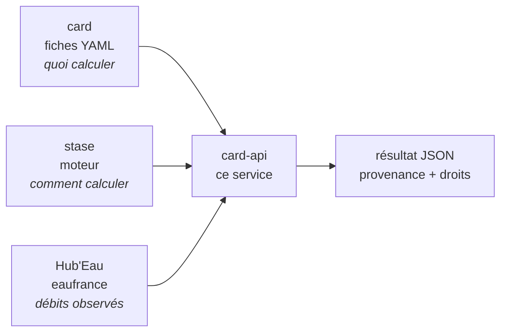

# card-api

Service web des fiches [card](https://github.com/lou-heraut/card) :
extraction de variables hydroclimatiques sur les débits de la Banque
Hydro (via [Hub'Eau](https://hubeau.eaufrance.fr/)) et diagnostic de
stationnarité Mann-Kendall / pente de Sen (via
[stase](https://github.com/lou-heraut/stase)).

**Documentation interactive : [https://card-api.riverly.inrae.fr/docs](https://card-api.riverly.inrae.fr/docs)**
(essai des requêtes dans le navigateur, schémas de réponse).

Service public de recherche (INRAE, UR RiverLy). Ouvert, sans
inscription ; code GPL-3, données Hub'Eau en Licence Ouverte.
Déploiement et développement : [INSTALL.md](INSTALL.md).

## Comment les pièces s'emboîtent



card ne calcule rien, stase ne connaît pas les fiches, et la donnée vient
d'ailleurs. C'est pourquoi chaque réponse porte la version des trois, et
les droits qui vont avec.

## Quelle porte prendre

| Votre cas | La porte | Pour voir |
|---|---|---|
| Quelques stations, ponctuellement | ce service | [la doc interactive](https://card-api.riverly.inrae.fr/docs) |
| Des milliers de stations, ou vos propres données | la bibliothèque Python, en local, sans quota | [dépôt card](https://github.com/lou-heraut/card) |
| Comprendre ce qu'une fiche calcule | la fiche dessinée | [`VCN10` en figure](https://card-api.riverly.inrae.fr/v1/cards/VCN10/figure) |
| Savoir quels filtres existent | le vocabulaire de classification | [`/v1/vocabulary`](https://card-api.riverly.inrae.fr/v1/vocabulary) |
| Brancher un site web | l'API depuis le navigateur (CORS ouvert) | [les fiches d'étiage](https://card-api.riverly.inrae.fr/v1/cards?phenomenon=basses%20eaux) |
| Publier un résultat | citer la fiche par son `swhid`, présent dans la réponse | [CITATION.cff](https://github.com/lou-heraut/card/blob/main/CITATION.cff) |
| Une variable qui n'existe pas | copier une fiche, l'adapter, l'exécuter chez vous | [développer sa propre fiche](https://github.com/lou-heraut/card#développer-sa-propre-fiche) |

## Les endpoints

| Endpoint | Rôle |
|---|---|
| `GET /v1` | point d'entrée : ce qu'est le service, ce qu'il relie, droits |
| `GET /v1/cards` | catalogue des fiches CARD, filtrable par facettes |
| `GET /v1/cards/{id}` | détail d'une fiche (fr/en) et liens vers sa définition |
| `GET /v1/cards/{id}/figure` | la fiche **dessinée** (texte) : sa chaîne de calcul |
| `GET /v1/vocabulary` | valeurs valides des facettes, donc les filtres acceptés |
| `GET /v1/stations` | recherche de stations hydrométriques |
| `GET /v1/extract` | chroniques Hub'Eau → variables CARD |
| `GET /v1/trend` | extraction + test de Mann-Kendall et pente de Sen |
| `POST /v1/jobs` | grosses demandes en file de calcul (202 + ticket) |
| `GET /v1/jobs/{id}` | statut et progression ; `/result` : résultat gelé |
| `GET /v1/health` | santé du service (file de calcul, disque) |
| `/docs` | documentation interactive (OpenAPI) |

Chaque réponse est en JSON et se suffit à elle-même : `data` (les
résultats), `meta` (unités, noms français et anglais, classification),
la source des données et les versions des logiciels. Deux formats au
choix : `orient=records` (défaut, une liste d'objets, comme Hub'Eau)
ou `orient=columns` (colonnaire, `{colonne: [valeurs]}`, plus
compact).

## Préparer sa demande

### La station

La recherche interroge le référentiel hydrométrique Hub'Eau par nom,
code ou département, et renvoie pour chaque station son code, son
libellé, ses coordonnées et son état de service. C'est aussi le moyen
de retrouver le code actuel d'une station connue sous son ancien code
Banque Hydro.

```bash
curl "https://card-api.riverly.inrae.fr/v1/stations?libelle=Austerlitz"
# → F700000103 | La Seine à Paris - Austerlitz [>2006]
curl "https://card-api.riverly.inrae.fr/v1/stations?departement=07&size=100"
```

### Les fiches

Chaque fiche définit une variable calculable sur la chronique de
débit : module, étiages, crues, saisonnalité... Le catalogue se
filtre par facettes de classification (`domain`, `phenomenon`,
`season`, `output`...) ou par texte libre, en français ou en anglais :

```bash
curl "https://card-api.riverly.inrae.fr/v1/cards?phenomenon=basses%20eaux&output=série"
curl "https://card-api.riverly.inrae.fr/v1/cards?operator=delta&search=VCN"
curl "https://card-api.riverly.inrae.fr/v1/cards/VCN10?lang=fr"      # détail d'une fiche
```

## Cas d'usage

Le même fil en Python puis en R : extraire des indicateurs annuels,
en tracer un, puis diagnostiquer sa tendance et superposer points et
droite de Sen. Les indicateurs annuels se tracent en points (une
valeur par an), pas en ligne continue.

Deux paramètres méritent un mot :

- `sampling=preferred` fige la fenêtre annuelle de calcul sur celle
  que chaque fiche déclare (par exemple l'année hydrologique 09-01
  pour les crues). Par défaut, les fiches d'étiage et de crue adaptent
  leur fenêtre à chaque station ; `preferred` rend les résultats
  directement comparables entre stations et reproductibles.
- `series=true` sur `/v1/trend` joint à la réponse, sous `series`,
  les séries extraites sur lesquelles la tendance a été calculée :
  points et diagnostic issus du même calcul, sans second appel.
- `stations_meta=true` joint les fiches du référentiel Hub'Eau des
  stations demandées (libellé, coordonnées, état de service). Un résultat
  devient autoportant : tracer une carte ne demande plus d'aller chercher
  les positions ailleurs.

### En Python

Extraction : module (QA) et étiage (VCN10) de la Seine à Paris.

```python
import requests, pandas as pd

r = requests.get("https://card-api.riverly.inrae.fr/v1/extract", params={
    "stations": "F700000103",
    "cards": "QA,VCN10",
    "start": "1990-01-01",
    "orient": "columns",              # directement ingérable par pandas
}).json()
```

Figure, avec l'unité lue dans les métadonnées :

```python
import matplotlib.pyplot as plt

vcn10 = pd.DataFrame(r["data"]["VCN10"])
meta = pd.DataFrame(r["meta"])
unit = meta.loc[meta.variable_en == "VCN10", "unit_fr"].iloc[0]
vcn10.plot(x="date", y="VCN10", style="o", ylabel=f"VCN10 [{unit}]")
plt.show()
```

Tendance du VCN10 : une ligne par station (H : tendance
significative ? p-value, pente de Sen absolue `a` et relative).

```python
r = requests.get("https://card-api.riverly.inrae.fr/v1/trend", params={
    "stations": "F700000103",
    "cards": "VCN10",
    "sampling": "preferred",
    "series": "true",
}).json()

tr = pd.DataFrame(r["data"]["VCN10"]).iloc[0]
```

Points et droite de Sen sur la même figure :

```python
s = pd.DataFrame(r["series"]["VCN10"])
dates = pd.to_datetime(s["date"])
years = (dates - pd.Timestamp("1970-01-01")).dt.days / 365.25
plt.plot(dates, s["VCN10"], "o")
plt.plot(dates, tr["a"] * years + tr["b"], "--")
plt.show()
```

### En R

Extraction : module (QA) et étiage (VCN10) de la Seine à Paris
(format `records` par défaut : `fromJSON` en fait des data.frame).

```r
library(jsonlite)

r <- fromJSON(paste0("https://card-api.riverly.inrae.fr/v1/extract?stations=F700000103",
                     "&cards=QA,VCN10&start=1990-01-01"))
```

Figure, avec l'unité lue dans les métadonnées :

```r
vcn10 <- r$data$VCN10
unit <- r$meta$unit_fr[r$meta$variable_en == "VCN10"]
plot(as.Date(vcn10$date), vcn10$VCN10,
     ylab = paste0("VCN10 [", unit, "]"))
```

Tendance du VCN10 : une ligne par station (H : tendance
significative ? p-value, pente de Sen absolue `a` et relative).

```r
r <- fromJSON(paste0("https://card-api.riverly.inrae.fr/v1/trend?stations=F700000103",
                     "&cards=VCN10&sampling=preferred&series=true"))
tr <- r$data$VCN10[1, ]
```

Points et droite de Sen sur la même figure :

```r
s <- r$series$VCN10
dates <- as.Date(s$date)
years <- as.numeric(dates) / 365.25
plot(dates, s$VCN10)
lines(dates, tr$a * years + tr$b, lty = 2)
```

### Grosses demandes : les jobs

Au-dessus de 10 stations ou 20 fiches, la demande devient un job,
sans inscription : la réponse `202` donne un ticket, le calcul se
fait en file, le résultat reste téléchargeable plusieurs jours avec
un bloc de provenance (paramètres, versions, date des données) qui le
rend citable et reproductible.

```python
job = requests.post("https://card-api.riverly.inrae.fr/v1/jobs", json={
    "endpoint": "trend",
    "stations": liste_de_codes,       # jusqu'à 100
    "cards": ["QA", "VCN10"],
    "sampling": "preferred",
}).json()
# suivre job["status_url"] (queued -> running -> done, avec progression)
# puis récupérer job["result_url"]
```

Les appels `GET /v1/extract` et `/v1/trend` trop gros basculent
automatiquement sur ce circuit (réponse `202` au lieu d'un refus).

## Quotas et clés de priorité

Le service est public avec un quota par IP et par minute ; en cas de
dépassement (`429`), l'en-tête `Retry-After` indique quand réessayer.
Les chroniques sont mises en cache 24 h côté serveur : répéter une
requête ne re-télécharge rien depuis Hub'Eau.

Pour un besoin massif ou récurrent (centaines de stations, chaînes de
traitement), demandez une clé de priorité gratuite en
[ouvrant une issue](../../issues/new?template=cle-de-priorite.yml).
Elle se passe en en-tête `X-API-Key` (de préférence à `key=`, qui
laisse la clé dans les logs web) : quotas par minute levés, plafonds
relevés (jusqu'à 1000 stations par job), jobs en tête de file, et
`GET /v1/jobs` liste vos jobs déposés avec la clé (tickets compris :
pratique pour retrouver un résultat dont le ticket est égaré).

Le jeton n'est communiqué qu'une fois, à la création (le serveur n'en
garde qu'un hachage) : conservez-le, un jeton perdu se remplace. Le
journal du service ne stocke jamais votre nom, seulement le préfixe
du jeton.

## Savoir ce qui a produit un résultat

Chaque réponse porte de quoi refaire le calcul plus tard, ou expliquer
pourquoi il ne redonne pas la même chose :

| Champ | Ce qu'il dit |
|---|---|
| `card_version`, `card_commit`, `card_swhid` | le corpus de fiches employé |
| `stase_version`, `stase_commit`, `stase_swhid` | le moteur de calcul employé |
| `meta[].version`, `meta[].swhid` | la définition de chaque variable, fiche par fiche |
| `data_fetched_at` | quand les chroniques Hub'Eau ont été lues |
| `data_fingerprint` | ce qu'elles contenaient |

Les identifiants `swh:` s'ouvrent en collant
`https://archive.softwareheritage.org/` devant : ils donnent le code et
les fiches tels qu'ils étaient, indépendamment de GitHub.

`data_fingerprint` demande une explication, parce qu'il ne se recalcule
pas de votre côté : c'est un **jeton de comparaison**, pas une somme de
contrôle. Il résume les chroniques employées, entières, avant tout
filtre de période. Deux résultats qui portent la même valeur reposent
sur la même donnée ; deux valeurs différentes signalent que Hub'Eau a
révisé sa donnée entre les deux appels, ce qui arrive régulièrement et
explique alors l'écart sans qu'il faille chercher du côté du calcul. Le
préfixe `v1:` est la version de l'algorithme : s'il change un jour, vous
saurez que deux empreintes ne sont plus comparables.

Pour un job, le résultat gelé porte en plus `data_fingerprints`, le
détail station par station : quand un lot de 200 stations change, il dit
laquelle.

## Périmètre

Le service ne fournit que des débits journaliers (fiches à entrée
`Q`) ; le diagnostic de tendance ne s'applique qu'aux fiches de forme
`series` (la tendance d'un scalaire ou d'une courbe n'a pas de sens).

## Citer

Les métadonnées de citation sont dans [CITATION.cff](CITATION.cff)
(bouton « Cite this repository » de GitHub) et
[codemeta.json](codemeta.json) (moissonné par Software Heritage et
HAL ; identifiant pérenne à venir par ce canal). Dans une
publication, citez aussi la source des données (Hub'Eau hydrométrie,
eaufrance, Licence Ouverte) et ce qui a produit votre résultat : chaque
réponse porte les versions et les identifiants Software Heritage du
corpus et du moteur, la version de chaque fiche employée, la date de
lecture des données et leur empreinte. Le détail est dans « Savoir ce
qui a produit un résultat » plus haut ; le résultat gelé d'un job les
rassemble dans un bloc de provenance avec les paramètres de l'appel.
