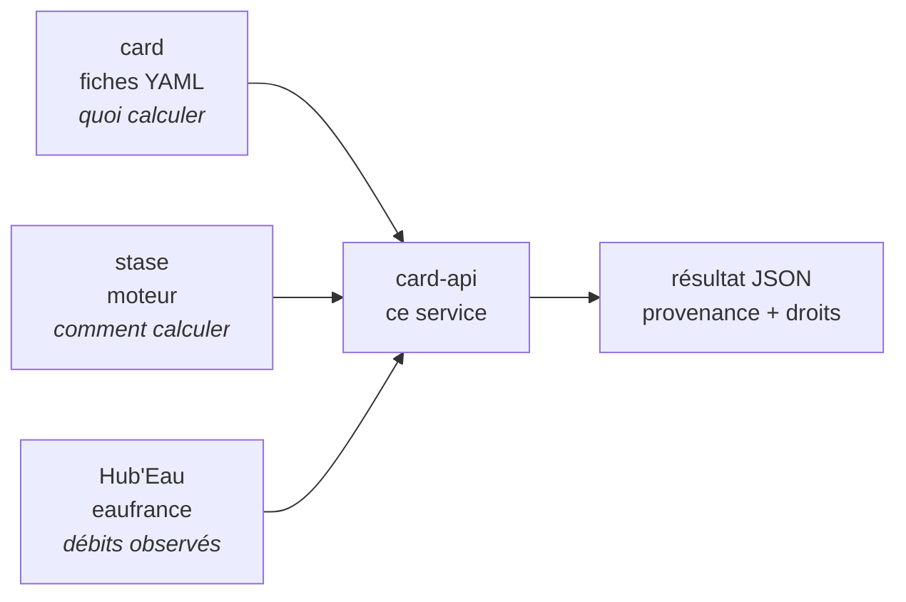

# card-api

Service web des fiches [card](https://github.com/lou-heraut/card) :
extraction de variables hydroclimatiques sur les débits de la Banque
Hydro (via [Hub'Eau](https://hubeau.eaufrance.fr/)) et diagnostic de
stationnarité Mann-Kendall / pente de Sen (via
[stase](https://github.com/lou-heraut/stase)).

**Documentation interactive : [https://card-api.riverly.inrae.fr/docs](https://card-api.riverly.inrae.fr/docs)**
(essai des requêtes dans le navigateur, schémas de réponse).

Service public de recherche (INRAE, UR RiverLy). Ouvert, sans
inscription ; code GPL-3, données Hub'Eau en Licence Ouverte.
Déploiement et développement : [INSTALL.md](INSTALL.md).

## Comment les pièces s'emboîtent


```mermaid
flowchart LR
  CARD["card<br/>fiches YAML<br/><i>quoi calculer</i>"] --> API
  STASE["stase<br/>moteur<br/><i>comment calculer</i>"] --> API
  HE["Hub'Eau<br/>eaufrance<br/><i>débits observés</i>"] --> API
  API["card-api<br/>ce service"] --> OUT["résultat JSON<br/>provenance + droits"]
```

card ne calcule rien, stase ne connaît pas les fiches, et la donnée vient
d'ailleurs. C'est pourquoi chaque réponse porte la version des trois, et
les droits qui vont avec.

## Quelle porte prendre

| Votre cas | La porte | Pour voir |
|---|---|---|
| Quelques stations, ponctuellement | ce service | [la doc interactive](https://card-api.riverly.inrae.fr/docs) |
| Des milliers de stations, ou vos propres données | la bibliothèque Python, en local, sans quota | [dépôt card](https://github.com/lou-heraut/card) |
| Comprendre ce qu'une fiche calcule | la fiche dessinée | [`VCN10` en figure](https://card-api.riverly.inrae.fr/v1/cards/VCN10/figure) |
| Savoir quels filtres existent | le vocabulaire de classification | [`/v1/vocabulary`](https://card-api.riverly.inrae.fr/v1/vocabulary) |
| Brancher un site web | l'API depuis le navigateur (CORS ouvert) | [les fiches d'étiage](https://card-api.riverly.inrae.fr/v1/cards?phenomenon=basses%20eaux) |
| Publier un résultat | citer la fiche par son `swhid`, présent dans la réponse | [CITATION.cff](https://github.com/lou-heraut/card/blob/main/CITATION.cff) |
| Une variable qui n'existe pas | copier une fiche, l'adapter, l'exécuter chez vous | [développer sa propre fiche](https://github.com/lou-heraut/card#développer-sa-propre-fiche) |

## Les endpoints

| Endpoint | Rôle |
|---|---|
| `GET /` | racine : liens typés vers le contrat, la doc et la version courante |
| `GET /v1` | point d'entrée : ce qu'est le service, ce qu'il relie, droits |
| `GET /v1/cards` | catalogue des fiches CARD, filtrable par facettes ; `ids` rend la sélection prête à coller |
| `GET /v1/cards/{id}` | détail d'une fiche (fr/en) et liens vers sa définition |
| `GET /v1/cards/{id}/figure` | la fiche **dessinée** (texte) : sa chaîne de calcul |
| `GET /v1/vocabulary` | valeurs valides des facettes, donc les filtres acceptés |
| `GET /v1/stations` | recherche de stations ; `codes` rend la sélection prête à coller |
| `GET /v1/extract` | chroniques Hub'Eau → variables CARD |
| `GET /v1/extract.csv` | les mêmes séries, en CSV pour le tableur |
| `GET /v1/trend` | extraction + test de Mann-Kendall et pente de Sen |
| `GET /v1/trend.csv` | les mêmes diagnostics, en CSV pour le tableur |
| `GET /v1/trend/figure` | le diagnostic **dessiné** (texte) : sens, ampleur, verdict |
| `POST /v1/jobs` | grosses demandes en file de calcul (202 + ticket) |
| `GET /v1/jobs/{id}` | statut et progression ; `/result` : résultat gelé |
| `GET /v1/health` | santé du service (file de calcul, disque) |
| `/docs` | documentation interactive (OpenAPI) |

Chaque réponse est en JSON et se suffit à elle-même : `data` (les
résultats), `meta` (unités, noms français et anglais, classification),
la source des données et les versions des logiciels. Deux formats au
choix : `orient=records` (défaut, une liste d'objets, comme Hub'Eau)
ou `orient=columns` (colonnaire, `{colonne: [valeurs]}`, plus
compact).

## Préparer sa demande

### La station

La recherche interroge le référentiel hydrométrique Hub'Eau par nom,
code ou département, et renvoie pour chaque station son code, son
libellé, ses coordonnées et son état de service. C'est aussi le moyen
de retrouver le code actuel d'une station connue sous son ancien code
Banque Hydro.

```bash
curl "https://card-api.riverly.inrae.fr/v1/stations?libelle=Austerlitz"
# → F700000103 | La Seine à Paris - Austerlitz [>2006]
curl "https://card-api.riverly.inrae.fr/v1/stations?departement=07&size=100"
```

La réponse porte un champ `codes` : tous les codes trouvés, déjà
séparés par des virgules, à coller tel quel dans le paramètre
`stations` d'`/v1/extract` ou d'`/v1/trend`. Vingt stations ne se
recopient pas une par une.

### Les fiches

Chaque fiche définit une variable calculable sur la chronique de
débit : module, étiages, crues, saisonnalité... Le catalogue se
filtre par facettes de classification (`domain`, `phenomenon`,
`season`, `output`...) ou par texte libre, en français ou en anglais :

```bash
curl "https://card-api.riverly.inrae.fr/v1/cards?phenomenon=basses%20eaux&output=série"
curl "https://card-api.riverly.inrae.fr/v1/cards?operator=delta&search=VCN"
curl "https://card-api.riverly.inrae.fr/v1/cards/VCN10?lang=fr"      # détail d'une fiche
```

Même chose côté fiches : le champ `ids` rend la sélection filtrée
prête à coller dans le paramètre `cards`. Attention, l'identifiant
d'une fiche est le nom de son fichier (colonne `id`), pas sa variable :
`ETPMA_month` produit `ETPMA_jan` à `ETPMA_dec`, et c'est le premier
qu'attendent les endpoints.

## Cas d'usage

Le même fil en Python puis en R : extraire des indicateurs annuels,
en tracer un, puis diagnostiquer sa tendance et superposer points et
droite de Sen. Les indicateurs annuels se tracent en points (une
valeur par an), pas en ligne continue.

Deux paramètres méritent un mot :

- `sampling=preferred` fige la fenêtre annuelle de calcul sur celle
  que chaque fiche déclare (par exemple l'année hydrologique 09-01
  pour les crues). Par défaut, les fiches d'étiage et de crue adaptent
  leur fenêtre à chaque station ; `preferred` rend les résultats
  directement comparables entre stations et reproductibles.
- `series=true` sur `/v1/trend` joint à la réponse, sous `series`,
  les séries extraites sur lesquelles la tendance a été calculée :
  points et diagnostic issus du même calcul, sans second appel.
- `/v1/trend/figure` rend le même résultat en table lisible, avec les
  mêmes paramètres : sens, ampleur, p-value et verdict en clair. De quoi
  lire une réponse sans traverser le JSON, dans un terminal comme dans
  `/docs`.
- `/v1/extract.csv` et `/v1/trend.csv` rendent les mêmes données en
  fichier ouvrable au tableur, virgule et point décimal. La provenance
  (versions, SWHID, source, empreinte, droits) voyage en lignes `#` en
  tête, que `read_csv(comment="#")` et `read.csv(comment.char="#")`
  sautent d'eux-mêmes : un fichier enregistré sait toujours dire d'où il
  vient. Le nom proposé au téléchargement porte l'analyse,
  `card-api_trend_F700000103_QA-VCN10_AR1_2005-2026_ac9c7eed.csv`.
- `stations_meta=true` joint les fiches du référentiel Hub'Eau des
  stations demandées (libellé, coordonnées, état de service). Un résultat
  devient autoportant : tracer une carte ne demande plus d'aller chercher
  les positions ailleurs.

### Quand la demande part en file de calcul

Une grosse demande reçoit un ticket (`202`) au lieu d'une réponse
immédiate. Ce qui décide n'est pas le nombre de stations mais le nombre
de stations **à télécharger** : rapatrier une chronique coûte environ
trente fois plus que la calculer. Vingt stations déjà lues répondent donc
en direct, les mêmes vingt à froid partent en file. La même URL peut par
conséquent donner un ticket au premier appel et un résultat au second,
et c'est voulu.

Le résultat d'un job se récupère dans la représentation de votre choix,
quelle que soit celle demandée au dépôt :

| route | rend |
|---|---|
| `/v1/jobs/{id}/result` | le JSON gelé, avec son bloc de provenance |
| `/v1/jobs/{id}/result.csv` | le même résultat en CSV, mêmes colonnes qu'en direct |
| `/v1/jobs/{id}/result/figure` | le même résultat dessiné (jobs de tendance) |

Ce qui limite le choix n'est pas la porte d'entrée mais ce que le
résultat contient : une extraction n'a pas de verdict de stationnarité à
dessiner. Le ticket rendu par un `.csv` porte directement l'adresse de
son CSV, il n'y a rien à deviner.

### Quand une station n'a rien à donner

Toutes les stations du référentiel hydrométrique ne publient pas de débit
journalier. Une échelle limnimétrique, par exemple, mesure une hauteur
d'eau : sans courbe de tarage elle n'a pas de série de débit, et rien
dans le référentiel ne l'annonce (ni `type_station`, ni `en_service`, qui
vaut d'ailleurs `false` pour beaucoup de stations fermées dont
l'historique est intact et parfaitement utilisable). La demander est le
seul moyen de le savoir.

Une telle station est donc **écartée du calcul, pas fatale** : les autres
sont calculées, et le résultat dit exactement ce qu'il contient.

| champ | contenu |
|---|---|
| `stations` | les stations réellement calculées, celles que `data` contient |
| `stations_requested` | celles que vous avez demandées |
| `stations_omitted` | les écartées, avec `reason` et `detail` |

`reason` vaut `no_series` (aucune chronique publiée), `no_data_in_period`
(chronique présente, mais rien dans la fenêtre demandée) ou
`ambiguous_site` (code de site dont plusieurs stations mesurent en
parallèle). Le bloc est **toujours** présent, vide quand tout va bien :
un client n'a pas à tester son existence.

Deux garde-fous. Si aucune station n'a de série, la demande est refusée
en `404` plutôt que rendue vide, un résultat sans lignes se laissant lire
comme un résultat. Et une panne Hub'Eau reste une erreur `504` : elle
n'est jamais transformée en omission, sans quoi un incident passager
produirait des résultats discrètement amputés.

L'information voyage dans toutes les représentations : bloc JSON, lignes
`# station écartée` en tête des `.csv`, mention en clair dans
`/v1/trend/figure`, et gelée dans le résultat d'un job.

### En Python

Extraction : module (QA) et étiage (VCN10) de la Seine à Paris.

```python
import requests, pandas as pd

r = requests.get("https://card-api.riverly.inrae.fr/v1/extract", params={
    "stations": "F700000103",
    "cards": "QA,VCN10",
    "start": "1990-01-01",
    "orient": "columns",              # directement ingérable par pandas
}).json()
```

Figure, avec l'unité lue dans les métadonnées :

```python
import matplotlib.pyplot as plt

vcn10 = pd.DataFrame(r["data"]["VCN10"])
meta = pd.DataFrame(r["meta"])
unit = meta.loc[meta.variable_en == "VCN10", "unit_fr"].iloc[0]
vcn10.plot(x="date", y="VCN10", style="o", ylabel=f"VCN10 [{unit}]")
plt.show()
```

Tendance du VCN10 : une ligne par station (H : tendance
significative ? p-value, pente de Sen absolue `a` et relative).

```python
r = requests.get("https://card-api.riverly.inrae.fr/v1/trend", params={
    "stations": "F700000103",
    "cards": "VCN10",
    "sampling": "preferred",
    "series": "true",
}).json()

tr = pd.DataFrame(r["data"]["VCN10"]).iloc[0]
```

Points et droite de Sen sur la même figure :

```python
s = pd.DataFrame(r["series"]["VCN10"])
dates = pd.to_datetime(s["date"])
years = (dates - pd.Timestamp("1970-01-01")).dt.days / 365.25
plt.plot(dates, s["VCN10"], "o")
plt.plot(dates, tr["a"] * years + tr["b"], "--")
plt.show()
```

### En R

Extraction : module (QA) et étiage (VCN10) de la Seine à Paris
(format `records` par défaut : `fromJSON` en fait des data.frame).

```r
library(jsonlite)

r <- fromJSON(paste0("https://card-api.riverly.inrae.fr/v1/extract?stations=F700000103",
                     "&cards=QA,VCN10&start=1990-01-01"))
```

Figure, avec l'unité lue dans les métadonnées :

```r
vcn10 <- r$data$VCN10
unit <- r$meta$unit_fr[r$meta$variable_en == "VCN10"]
plot(as.Date(vcn10$date), vcn10$VCN10,
     ylab = paste0("VCN10 [", unit, "]"))
```

Tendance du VCN10 : une ligne par station (H : tendance
significative ? p-value, pente de Sen absolue `a` et relative).

```r
r <- fromJSON(paste0("https://card-api.riverly.inrae.fr/v1/trend?stations=F700000103",
                     "&cards=VCN10&sampling=preferred&series=true"))
tr <- r$data$VCN10[1, ]
```

Points et droite de Sen sur la même figure :

```r
s <- r$series$VCN10
dates <- as.Date(s$date)
years <- as.numeric(dates) / 365.25
plot(dates, s$VCN10)
lines(dates, tr$a * years + tr$b, lty = 2)
```

### Grosses demandes : les jobs

Au-dessus de 10 stations ou 20 fiches, la demande devient un job,
sans inscription : la réponse `202` donne un ticket, le calcul se
fait en file, le résultat reste téléchargeable plusieurs jours avec
un bloc de provenance (paramètres, versions, date des données) qui le
rend citable et reproductible.

```python
job = requests.post("https://card-api.riverly.inrae.fr/v1/jobs", json={
    "endpoint": "trend",
    "stations": liste_de_codes,       # jusqu'à 100
    "cards": ["QA", "VCN10"],
    "sampling": "preferred",
}).json()
# suivre job["status_url"] (queued -> running -> done, avec progression)
# puis récupérer job["result_url"]
```

Les appels `GET /v1/extract` et `/v1/trend` trop gros basculent
automatiquement sur ce circuit (réponse `202` au lieu d'un refus).

## Quotas et clés de priorité

Le service est public avec un quota par IP et par minute ; en cas de
dépassement (`429`), l'en-tête `Retry-After` indique quand réessayer.
Les chroniques sont mises en cache 24 h côté serveur : répéter une
requête ne re-télécharge rien depuis Hub'Eau.

Si vous atteignez le quota, c'est presque toujours qu'une boucle
appelle le service une fois par station. Ce n'est pas la bonne forme :
`stations` prend une **liste** (`stations=A,B,C`), un appel rapporte
tout, et au-delà des plafonds synchrones la demande bascule d'elle-même
en file de calcul. Le quota est calculé large pour ne gêner personne en
usage normal, y compris tout un établissement derrière une même adresse
publique.

Pour un besoin massif ou récurrent (centaines de stations, chaînes de
traitement), demandez une clé de priorité gratuite **par courriel** à
<louis.heraut@inrae.fr> : qui vous êtes, l'usage prévu, et le projet
associé si vous voulez. Attribution manuelle, réponse rapide. Le jeton
vous revient par le même canal, ce qui est la raison de ce choix : une
issue GitHub est publique, le jeton ne peut pas y transiter.
Elle se passe en en-tête `X-API-Key` (de préférence à `key=`, qui
laisse la clé dans les logs web) : quotas par minute levés, plafonds
relevés (jusqu'à 1000 stations par job), jobs en tête de file, et
`GET /v1/jobs` liste vos jobs déposés avec la clé (tickets compris :
pratique pour retrouver un résultat dont le ticket est égaré).

Le jeton n'est communiqué qu'une fois, à la création (le serveur n'en
garde qu'un hachage) : conservez-le, un jeton perdu se remplace. Le
journal du service ne stocke jamais votre nom, seulement le préfixe
du jeton.

## Savoir ce qui a produit un résultat

Chaque réponse porte de quoi refaire le calcul plus tard, ou expliquer
pourquoi il ne redonne pas la même chose :

| Champ | Ce qu'il dit |
|---|---|
| `card_version`, `card_commit`, `card_swhid` | le corpus de fiches employé |
| `stase_version`, `stase_commit`, `stase_swhid` | le moteur de calcul employé |
| `meta[].version`, `meta[].swhid` | la définition de chaque variable, fiche par fiche |
| `data_fetched_at` | quand les chroniques Hub'Eau ont été lues |
| `data_fingerprint` | ce qu'elles contenaient |

Les identifiants `swh:` s'ouvrent en collant
`https://archive.softwareheritage.org/` devant : ils donnent le code et
les fiches tels qu'ils étaient, indépendamment de GitHub.

`data_fingerprint` demande une explication, parce qu'il ne se recalcule
pas de votre côté : c'est un **jeton de comparaison**, pas une somme de
contrôle. Il résume les chroniques employées, entières, avant tout
filtre de période. Deux résultats qui portent la même valeur reposent
sur la même donnée ; deux valeurs différentes signalent que Hub'Eau a
révisé sa donnée entre les deux appels, ce qui arrive régulièrement et
explique alors l'écart sans qu'il faille chercher du côté du calcul. Le
préfixe `v1:` est la version de l'algorithme : s'il change un jour, vous
saurez que deux empreintes ne sont plus comparables.

Pour un job, le résultat gelé porte en plus `data_fingerprints`, le
détail station par station : quand un lot de 200 stations change, il dit
laquelle.

## Périmètre

Le service ne fournit que des débits journaliers (fiches à entrée
`Q`) ; le diagnostic de tendance ne s'applique qu'aux fiches de forme
`series` (la tendance d'un scalaire ou d'une courbe n'a pas de sens).

## Citer

Les métadonnées de citation sont dans [CITATION.cff](CITATION.cff)
(bouton « Cite this repository » de GitHub) et
[codemeta.json](codemeta.json) (moissonné par Software Heritage et
HAL ; identifiant pérenne à venir par ce canal). Dans une
publication, citez aussi la source des données (Hub'Eau hydrométrie,
eaufrance, Licence Ouverte) et ce qui a produit votre résultat : chaque
réponse porte les versions et les identifiants Software Heritage du
corpus et du moteur, la version de chaque fiche employée, la date de
lecture des données et leur empreinte. Le détail est dans « Savoir ce
qui a produit un résultat » plus haut ; le résultat gelé d'un job les
rassemble dans un bloc de provenance avec les paramètres de l'appel.

## Mentions légales

**Éditeur.** INRAE (Institut national de recherche pour l'agriculture,
l'alimentation et l'environnement), établissement public à caractère
scientifique et technologique, 147 rue de l'Université, 75338 Paris
Cedex 07. Service développé et exploité par l'unité de recherche
**RiverLy**, 5 rue de la Doua, CS 20244, 69625 Villeurbanne Cedex.

**Responsable de la publication.** Louis Héraut (INRAE, UR RiverLy),
<louis.heraut@inrae.fr>.

**Hébergement.** Machine virtuelle des centres de données d'INRAE.

**Propriété intellectuelle.** Le code du service, du corpus de
définitions [card](https://github.com/lou-heraut/card) et du moteur
[stase](https://github.com/lou-heraut/stase) est sous
[GPL-3.0-or-later](https://www.gnu.org/licenses/gpl-3.0.html). Les
observations hydrométriques proviennent de
[Hub'Eau](https://hubeau.eaufrance.fr/) (eaufrance) et restent sous
[Licence Ouverte / Etalab 2.0](https://www.etalab.gouv.fr/licence-ouverte-open-licence/).
Chaque réponse du service porte ces droits dans son bloc `rights`.

### Données personnelles

Le service est **public, sans inscription et sans compte** : le
consulter et l'interroger ne demande aucune identité. Deux traitements
existent néanmoins, de natures très différentes.

**1. Le journal d'usage, anonymisé.** Une ligne par requête de calcul :
horodatage, endpoint appelé, nombre de stations et variables demandées,
et un identifiant technique dérivé de l'adresse IP. L'adresse IP
elle-même n'est **jamais écrite** : seul en est conservé un condensat
SHA-256 salé et tronqué, dont le sel est propre au déploiement. Il
permet de compter des visiteurs distincts sans permettre de remonter à
quiconque. Aucun traceur, aucun cookie, aucune mesure d'audience tierce.

*Finalité* : mesurer l'usage du service, ce qui constitue la preuve
d'impact attendue dans les dossiers de financement de la recherche
publique. *Base légale* : l'exécution de la mission d'intérêt public
d'INRAE. *Conservation* : journal segmenté par année, les fichiers
anciens sont supprimés. Ces données étant anonymisées, elles ne
permettent pas de vous identifier et aucune demande individuelle ne peut
y être rattachée.

**2. Les clés de priorité, nominatives.** Une clé est attribuée à une
personne identifiée, et le fichier de clés du serveur conserve son
**nom et son organisme**, associés au préfixe public du jeton et à sa
date de création. Le jeton lui-même n'est pas conservé, seul son
condensat l'est.

*Finalité* : attribuer et révoquer les clés, et distinguer les usages
massifs dans les statistiques. *Base légale* : l'exécution de la mission
d'intérêt public d'INRAE. *Conservation* : jusqu'à la révocation de la
clé, qui efface le lien entre le préfixe et la personne. *Diffusion* :
le journal d'usage ne reçoit **que le préfixe**, jamais le nom.

Une clé se demande **par courriel**, et non par une issue publique :
votre nom, votre organisme et votre projet n'ont pas à être exposés, et
le jeton lui-même ne peut voyager que par un canal privé.

**Vos droits.** Sur les données nominatives des clés, vous disposez d'un
droit d'accès, de rectification, d'opposition pour motifs légitimes, de
limitation et d'effacement. Pour les exercer, ou pour toute question sur
ces traitements, écrire à <louis.heraut@inrae.fr>, ou au délégué à la
protection des données d'INRAE : <cil-dpo@inrae.fr>, INRAE, 24 chemin de
Borde Rouge, Auzeville, CS 52627, 31326 Castanet-Tolosan Cedex.

En cas de désaccord persistant, vous pouvez saisir la CNIL, 3 place de
Fontenoy, TSA 80715, 75334 Paris Cedex 07.

Politique de protection des données d'INRAE :
<https://science-ouverte.inrae.fr/fr/donnees-personnelles>.
